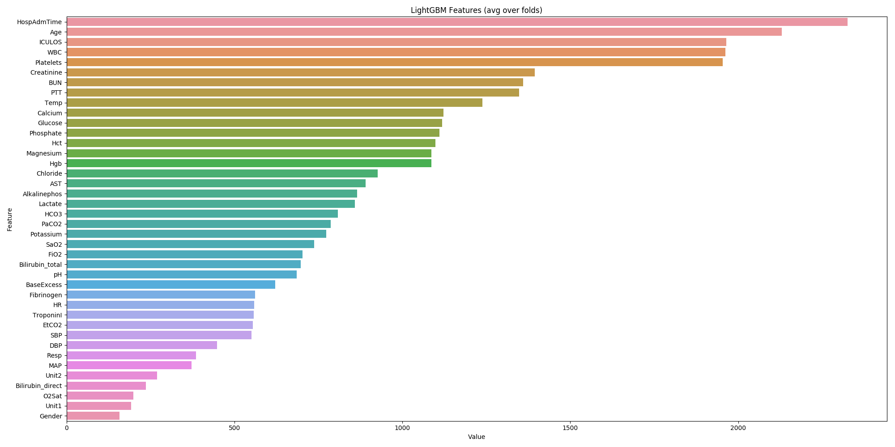

## Overview

#### Intro
This is my initial solution for Physionet 2019 Challenge that I had to abandon. 
I don't know the score, I will be grateful if anyone can check it.

#### Solution

I implemented 3 solutions: **RNN classifier** (GRU), **Transformer Classifier**, and **LightGBM**.

Because dataset is very unbalanced, it was easier to train LightGBM so I focused on this solution.
All the models can be ensembled and tested with the same splits.

---

You can easily run Neural Network switching LightGBM to PytorchClassifer in code and commenting features saving.
I'm not going to refactor this at the moment.

Cool features:

    - tensorboard logger
    - loading data with similar lengths in batch (sorted and then bucketed) results in  faster training because 
    doesn't wait for shortest examples + almost no padding
    - Transformer or GRU

---

LightGBM is fed with raw data with no future extraction. It is possible to pass raw data with some lag features
and it will benefit for sure, so the first attempts can be found in the repo.

LightGBM saves 5 models that should be used in ensembling, as an average prediction. It also performs 
the threshold search for the best threshold and save features importance.

---

All the runs perform extensive logging that should faciliate the process of preparing the solutions.


## Results

LightGBM scores 0.40072137437968547 in Stratified 5 fold local CV, without tuning. It can be even better in the real 
test because of ensembling. 

Classifier works on almost raw data!


## Installation

Be careful with torch installation - it may differ on the platforms
``pip install -r requirements.txt``

Download the data, directory _training_ into 

_data/raw/_

## Running

1. Convert data to .csv
    ```python convert_to_csv.py```
    
    it create _data/processed/training_ directory with .csv files

2. Convert data to pickle and hdf, with different NaN filling
    ```python rewrite_data.py```
    
    it creates many pickle files with a different strategy of filling the NaNs. you can uncomment most of them but training_filled.pickle works fine.
   
3. OPTIONAL: lag features
    ```python add_lag_features.py```

4. train
    Training as is will train lightgbm models and will save logs in _data/logs_


## More

There are some plotting scripts etc so investigate. Raw features importance:



